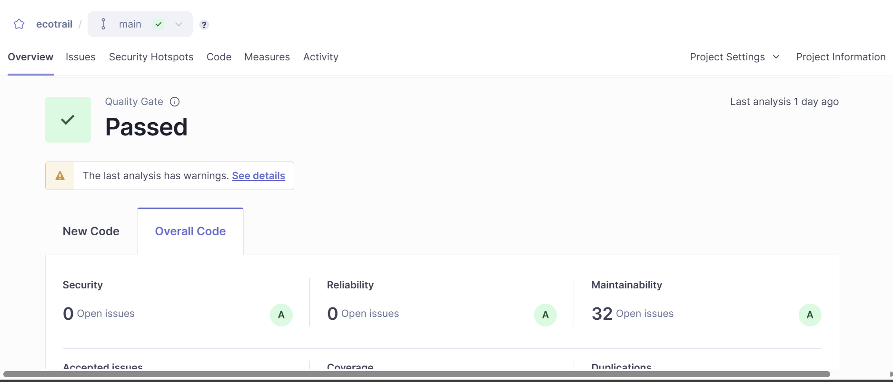
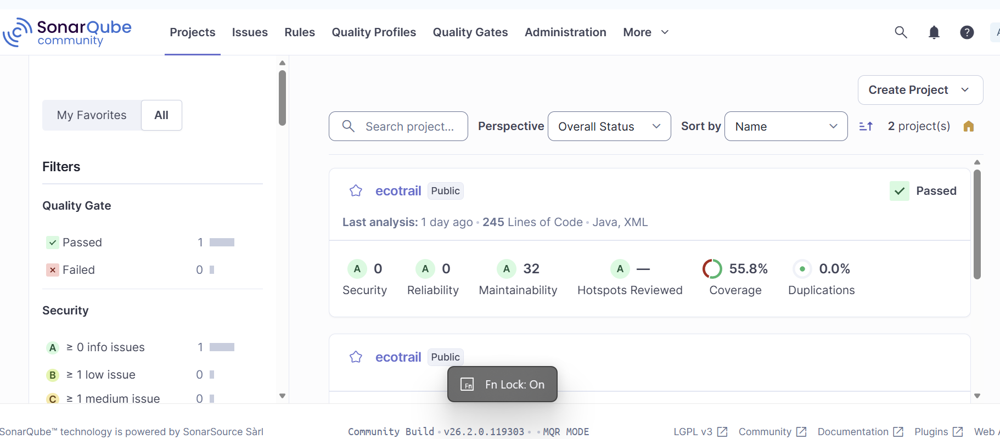

# 🌿 EcoTrail Analytics  
### Java • Maven • JUnit 5 • SonarQube

🚀 A mini analytics platform for managing hiking trail activity and evaluating **code quality** using SonarQube.

---

## 📖 About the Project
EcoTrail is a Java console application that stores and analyzes information about hiking trails across different regions.

The goal of the project is twofold:

1. Build collection-driven business logic.
2. Measure reliability, maintainability, and test coverage through SonarQube.

---

## ✨ Key Features
🌲 Add and manage trail records  
📍 Search trails by region  
📊 Group by difficulty  
🏆 Find most-hiked trails  
📈 Region-wise hike counts  
🧮 Difficulty statistics  
🧪 Unit tested with JUnit 5  

---

## 🧱 Core Components

| Class | Purpose |
|------|---------|
| `Trail` | Model class representing a trail |
| `TrailUtil` | Business logic & analytics |
| `UserInterface` | Console execution layer |
| `TrailUtilTest` | Unit tests |

---

## 🛠️ Tech Stack
- ☕ Java  
- 📦 Maven  
- 🧪 JUnit 5  
- 📉 SonarQube Community Edition  
- 💻 VS Code  

---

## 📁 Project Structure

```
ecotrail
│
├── src
│   ├── main
│   │   └── java
│   │       ├── Trail.java
│   │       ├── TrailUtil.java
│   │       └── UserInterface.java
│   │
│   └── test
│       └── java
│           └── TrailUtilTest.java
│
├── screenshots
│   ├── dashboard.png
│   └── coverage.png
│
└── pom.xml
```

---

## ⚙️ How to Run

### ▶️ Run Application

```
mvn compile
mvn exec:java

```

---


### 🧪 Run Tests

```
mvn clean test

```

### 📊 SonarQube Analysis

```
mvn sonar:sonar -Dsonar.login=YOUR_TOKEN

```

Server URL:

```
http://localhost:9000
```

---

## 📷 SonarQube Results

### 🧾 Quality Gate & Dashboard


---

### 📊 Code Coverage


---

## 🧠 What This Project Demonstrates
✅ Practical usage of Java Collections  
✅ Stream & aggregation operations  
✅ Clean modular design  
✅ Automated testing  
✅ Static code quality inspection  
✅ Maintainability awareness  

---

## 🎯 Outcome
The project successfully passed the SonarQube Quality Gate ✔️  
with strong reliability and maintainability metrics.

---

